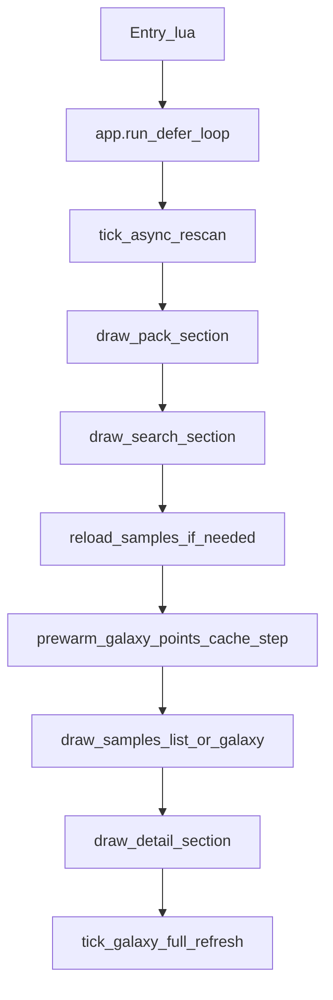

# Sample Lode Manager — プロダクト概要と現状（2026-05）

新しいチャットや開発者が **このリポジトリの全体像**を短時間で把握するためのドキュメントです。  
インストール手順はリポジトリ直下の [README.md](../../README.md)、UI 不具合・パフォーマンスの詳細は [ui_docking_fix_summary_2026-04-06_ja.md](./ui_docking_fix_summary_2026-04-06_ja.md) を参照してください。

---

## 1. これは何か

**REAPER 用のサンプルブラウザ／マネージャ**です。ローカルに置いたサンプルパックをスキャンし、SQLite にメタデータを蓄え、ReaImGui で次を行います。

- パック一覧の閲覧・フィルタ
- BPM / キー / タグ / テキスト検索による絞り込み
- リスト表示と **ギャラクシー（2D 散布図）** 表示
- 波形プレビュー、プロジェクト BPM へのマッチ再生
- アレンジへのドラッグ＆ドロップ挿入（環境依存）
- Splice ライブラリ DB のインポート・パス再リンク（Manage 画面）

配布は **ReaPack** 想定。エントリは `SampleLodeManager/oshibacomyaku_Sample Lode Manager.lua`（`@version` はエントリスクリプトを参照）。

---

## 2. 技術スタック

| 層 | 内容 |
|----|------|
| ホスト | REAPER 7+、ReaScript（Lua 5.4） |
| UI | **ReaImGui**（Dear ImGui バインディング） |
| DB | **SQLite**（`lsqlite3complete` を同梱バイナリで `require`） |
| 解析 | **Python** ワーカー（ファイル名 NLP、オーディオ特徴、UMAP 埋め込みなど） |
| その他 | SWS（プレビュー API）、js_ReaScriptAPI（一部 D&D 等） |

**GPU による汎用高速化**は ReaScript の枠ではほぼ期待できません。ボトルネックは SQL 全件取得・ディスク I/O・Python 同期バッチが中心です（ImGui 描画自体は REAPER 側のグラフィックス経由）。

---

## 3. ディレクトリ構成（要点）

```
samplemanager/
├── README.md                          # 依存関係・配布・ライセンス（英語）
└── SampleLodeManager/
    ├── oshibacomyaku_Sample Lode Manager.lua   # エントリ（package.path / cpath 設定 → app.run）
    ├── bin/                           # プラットフォーム別 lsqlite3complete
    ├── licenses/
    ├── docs/                          # Git に含める日本語ドキュメント
    └── src/
        ├── lib/
        │   ├── core/                  # アプリ本体・UI モジュール
        │   │   ├── app.lua            # ★ メインループ・状態・大半のロジック
        │   │   ├── scan_controller.lua
        │   │   ├── ui_pack.lua / ui_search.lua / ui_samples_list.lua / ui_samples_galaxy.lua
        │   │   ├── ui_imgui_utils.lua / ext_state.lua / key_bpm_utils.lua
        │   │   └── ...
        │   ├── db/
        │   │   ├── db_manager.lua     # SQLite モジュール検出
        │   │   └── sqlite_store.lua   # ★ スキーマ・クエリ・スキャン・Python 呼び出し
        │   ├── waveform.lua
        │   └── cover_art.lua
        └── python/                    # phase_a〜e など解析スクリプト
```

DB ファイルの既定パス: `{REAPER ResourcePath}/SampleLodeManager/SampleLodeManager.sqlite`  
（旧版は `{ResourcePath}/SampleLodeManager.sqlite` 直下 — 初回起動時に自動移行）

Python 作業用 TSV: `{ResourcePath}/SampleLodeManager/work/`（処理後削除。レガシー直下 TSV は手動削除可）

---

## 4. 実行フロー（1 フレームのイメージ）

エントリ → `require("lib.core.app")` → `M.run()` → `r.defer(loop)` で毎フレーム `ImGui_Begin` 内を描画。



- **状態の中心**: `app.lua` 内の `state`（フィルタ、`state.rows` 一覧、選択、UI 折りたたみ、ExtState 由来の設定など）と `state.runtime`（キャッシュ、perf、デバウンス用フィールド）。
- **サンプル一覧の再読込**: `state.needs_reload_samples` → `reload_samples_if_needed()` → `sqlite_store.get_samples(..., limit=100000, sort_spec)`。**最大 10 万行**を同期取得するため、ここが最大のスパイク源になり得る。
- **ライブラリスキャン**: `scan_controller.tick_async_rescan()` がフレームごとに小さな `step_budget` で DB 更新（UI を止めにくい設計）。

---

## 5. 主要 UI モジュール

| モジュール | 役割 |
|------------|------|
| `ui_pack.lua` | パック一覧（Splice / Other）、アクティブパック strip、ソート |
| `ui_pack_manage_sources.lua` | ルート追加、Splice DB インポート、再リンク、スキャン UI |
| `ui_search.lua` | BPM / キー / タイプ / タグ / テキスト検索、タグサジェスト |
| `ui_samples_list.lua` | テーブル形式のサンプル一覧、仮想スクロール、お気に入り |
| `ui_samples_galaxy.lua` | 2D ギャラクシー、Update Galaxy、埋め込みプロファイル |
| `app.lua`（detail 部） | 波形、プレビュー、タグチップ、編集ポップアップ |

`ui_imgui_utils.with_child` などで **BeginChild / EndChild の対称性**を守るのが ImGui 安定動作の前提（過去にドッキング時クラッシュの主因になった）。

---

## 6. データ・解析パイプライン（ざっくり）

1. **スキャン**（`sqlite_store` + `scan_controller`）: ルート配下のオーディオを走査し `samples` / `analysis` 等に格納。
2. **Phase A〜C**（Python）: ファイル名・メタから BPM / キー / タイプ推定など。
3. **Phase D**: オーディオ特徴（brightness, decay, tonalness 等）。
4. **Phase E**: UMAP 等で `embed_x` / `embed_y`（ギャラクシー座標）。

**Update Galaxy**（`ui_samples_galaxy` → `state.manage.galaxy_full_refresh`）は、非同期スキャン後に **repair（欠損特徴の再解析）と rebuild（埋め込み再計算）を同期一括実行**する。大きなライブラリでは **REAPER が数秒〜長時間フリーズ**し得る。フレーム分割 API は現状なし（進捗ウィンドウ＋注意文言のみ）。

---

## 7. 現状（2026-05 時点）

### 動作確認の目安

- 起動・基本操作（パック選択、検索、リスト／ギャラクシー切替、プレビュー、フィルタ）は **問題なく動く**報告あり。
- ImGui スタックエラー（`End` 過多など）は **2026-04 のドッキング修正**で主因は解消済み。

### 実装済みのパフォーマンス対策

詳細は [ui_docking_fix_summary §9–10](./ui_docking_fix_summary_2026-04-06_ja.md) 参照。

- フィルタ変更時の **`get_samples` デバウンス（約 0.16s）**（初回ロード除く）
- ギャラクシー点キャッシュの **ステップ budget**、`file_exists` のパスキャッシュ、再読込後の低 budget ランプ
- **`prewarm_galaxy_points_cache_step` はギャラクシータブ以外**でのみ実行（描画と二重負荷を避ける）
- `reload_pack_lists` の **1 フレーム 1 回フラッシュ**、`pack_display_name_by_id` マップ
- フィルタ署名に **ソート条件**を含める
- **perf オーバーレイ**: ExtState `SampleLodeManager` / `ui_perf_overlay` = `true` で `scan` / `rld` / `pre` / `gfr` / `pack` / `search` / `detail` の平均 ms を画面下部に表示

### 既知の制約・今後の候補

| 項目 | 内容 |
|------|------|
| `get_samples` 全件 | 依然として最大スパイク。LIMIT / ページングまたはギャラクシー専用軽量クエリは **未実装**（§10 ドラフト） |
| Update Galaxy | Python 同期バッチのためフリーズしやすい。**step 分割 API なし** |
| GPU 活用 | ReaScript 単体では現実的でない。データ量削減・デバウンス・計測が主戦場 |
| リポジトリ直下 `docs/` | `.gitignore` 対象のことがある。Git 用メモは `SampleLodeManager/docs/` に置く |

---

## 8. 開発・デバッグのヒント

- **構文チェック**: `luac -p SampleLodeManager/src/lib/core/app.lua`
- **変更の中心**: ほとんどの機能は `app.lua` と `sqlite_store.lua`。UI 分割は `ui_*.lua`。
- **ImGui 不具合**: 非表示 `BeginChild` に対する `EndChild` の有無を疑う（`ui_imgui_utils`）。
- **パフォーマンス**: `ui_perf_overlay` を有効化し、フィルタ連打時の **`rld`**、ギャラクシー操作時の **`pre`**、Update Galaxy 時の **`gfr`** を見る。
- **コミット**: ユーザーが明示するまで commit しない（プロジェクト方針）。`debug-*.log` はコミットしない。

---

## 9. 関連ドキュメント

| ファイル | 内容 |
|----------|------|
| [README.md](../../README.md) | 依存関係、ReaPack、同梱バイナリ、ライセンス |
| [ui_docking_fix_summary_2026-04-06_ja.md](./ui_docking_fix_summary_2026-04-06_ja.md) | ImGui ドッキング不具合、リファクタ、perf オーバーレイ、将来計画ドラフト |
| [GUI_DESIGN_RULES_ja.md](./GUI_DESIGN_RULES_ja.md) | ReaImGui GUI の色・フォント・サイズルール（他 ReaScript 共通用） |
| [DEBUG_ManageSources_SQLite_ja.md](./DEBUG_ManageSources_SQLite_ja.md) | Manage Sources「SQLite unavailable」調査手順・次チャット用プロンプト |
| [git_basics_ja.md](./git_basics_ja.md) | Git の基本（日本語） |
| [bin/README.md](../bin/README.md) | ネイティブ SQLite バイナリの配置 |

---

## 10. 用語メモ

- **oneshot / loop**: サンプルタイプ。ギャラクシーは主に oneshot の埋め込み座標を利用。
- **Splice**: 外部サンプルサービス由来のパック／DB インポート経路。
- **ExtState**: REAPER の `GetExtState` / `SetExtState`。UI レイアウトや `ui_perf_overlay` など永続設定に使用（セクション名 `SampleLodeManager`）。
